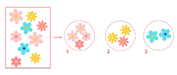

# Introdução a Cluster 🔗

## O que é cluster

Um **cluster** em ciência de dados refere-se a um grupo de dados ou objetos que são mais **semelhantes entre si** do que com os de outros grupos. O processo de agrupar esses dados é chamado de **clustering** (agrupamento). 

É uma técnica de aprendizado de máquina não supervisionado que busca identificar padrões ou estruturas ocultas em um conjunto de dados sem rótulos predefinidos.

### Exemplo

Se você tem um conjunto de dados sobre diferentes tipos de flores, um algoritmo de clustering pode agrupar as flores de acordo com características como cor, tamanho ou tipo de pétala, mesmo sem saber previamente quais são essas características.

O grupo da foto são semelhantes porem não iguais entre elas. O processo de **clustering** agrupou em 3 grupos em que cada grupo resultante (cluster) contém flores que são semelhantes entre si e diferentes das flores em outros grupos.  