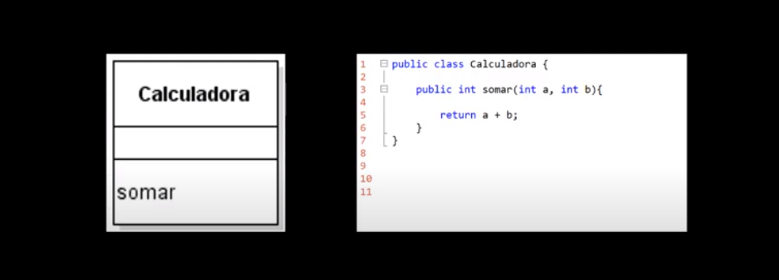
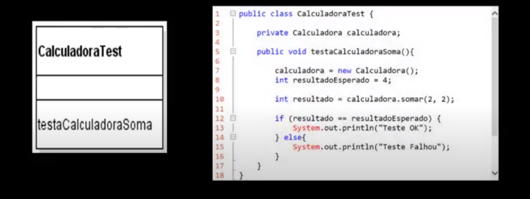

# TDD (Test Driven Development) ✅
É uma prática de desenvolvimento de software defendida pelo eXtremme Programming (XP). Nada mais é do que desenvolvimento orientado a teste. Tem como premissa principal escrever os teste do código antes dos próprios códigos. O desenvolvedor já deve saber de antemão o resultado que ele espera do código, para assim, depois de codificar o testes, fazer os códigos. - [TDD (Test Driven Development) // Dicionário do Programador][1]

A base do TDD são os testes unitários, validando a menor parte do código. Porém não é o único método a se utilizar esses tipos de teste.

## 🔖 Tópicos

  
<b>🤖&nbsp;Testes para Android</b>

- [Android Studio e os testes](TestesAndroid/AndroidStudioEOsTestes.md)
  - O funcionamento dos teste no Android Studio
- [Espresso](TestesAndroid/Espresso.md)
  - Cria testes concisos, bonitos e confiáveis para a IU do Android

  
<b>🎲&nbsp;Testes de Banco</b>

- [Regras de segurança de teste de unidade com o Firebase](TestesBanco/TesteRegraSegurançaFirebase.md)
  - As regras de segurança do Firebase protegem os seus dados contra usuários mal-intencionados [...] podemos fazer varios teste de diversos cenarios para que o banco fique cada vez mais seguro

## O TDD nasce com muita influência do:
- **DDD** (Domain Drive Desing): programação orientada a design;
- **BDD** (Behavior Driven Development): programação orientada a comportamento.

## Vantagem do TDD:
- Quando qualquer alteração é feita, poderá garantir que tudo estará funcionando.
- Retirar códigos inúteis da aplicação principal.
- O programador não perderá tempo tentando encontrar a falha.
- Um código mais confiável.

## Ciclo do TDD
- **Red:** Escrever um teste que falha. Acompanhe a falha.
- **Green:** Refaça o código até o teste passar.
- **Refactor:** Refatorar seu código em busca de eliminar redundância e acoplamentos.
> "Primeiro faça, depois faça certo e depois faça melhor...E assim começa tudo de novo"

## Ferramentas e framework
- **PHP**: PHPUnit e Cucumber
- **JavaScript / Nodejs**: Jasmine e Mocha
- **Java**: JUnit
- **Python**: PyUnit
- **.NET**: NUnit

## Testes Conceitos
**Conceito:** O teste em si, contata se algo funciona corretamente, de acordo com que é esperado.

### Tipos de teste
- **Funcional:** É quando a aplicação inteira, ou pate significativa, é entre ao cliente para testar.
- **Smoke Test:** É o teste que o desenvolverdor faz antes de entregar a aplicação para teste ao cliente.
- **Integração:** É um teste que foca nos componentes estão interagindo entre si. Verifica se as partes estão funcionando entre si.
- **Segurança:** Vai verificar se a aplicação é segura ou está sujeita a ataque.
- **Carga:** Checar o comportamento do software quando há muitos usuários.
- **Unitário:** É um teste feito pelo dessenvolverdor, ele foca exclusivamente ao método de uma class.

### Teste Unitário
**Conceito:** É um trecho de código, que executa outro trecho de código e verifica se executou corretamente.

   

[1]: https://www.youtube.com/watch?v=bLdEypr2e-8